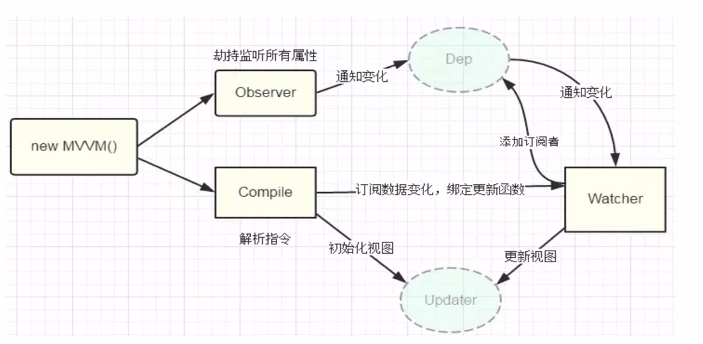
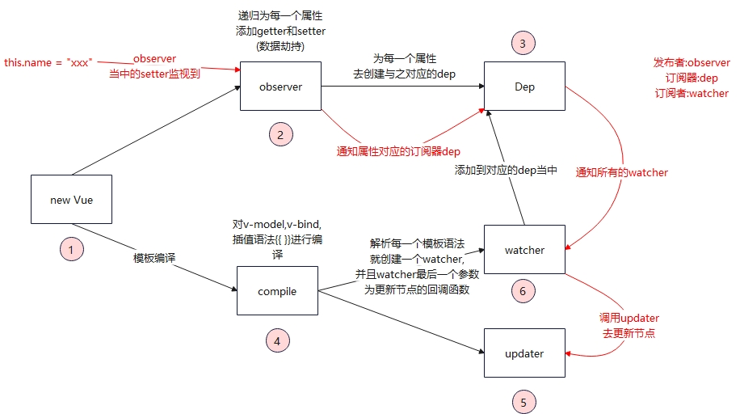

### 前言

> 具体可以看bilibili的视频https://www.bilibili.com/video/BV15D4y1o73Z

源码可以自己下载,和视频基本一样

下载地址:https://github.com/superBiuBiuMan/vue-write-self

### 笔记

### 第五集的时候为什么设置Dep.target = this后又置为空

```js
获取旧值表达式为以下
getOldValue(){
    Dep.target = this;
    const oldvalue = compileUtil.getValue(this.expr,this.vm.$data);
    Dep.target = null;
    return oldValue;
}
```

* 一开始我看到这个,很奇怪,**觉得这样子会可以让Observer成功添加到watcher吗?**
    * 是的,的确可以,在Observer当中,我们通过`defineProperty`为data当中的每一个属性添加了set和get方法,也就是说
      我们**每次读取值也会触发set**,设置值则会触发get,所以当我们初始化页面编译模板的时候,**就会触发set,从而向对应的dep添加对应的watcher**
* 所以这就解释了调用`compileUtil.getValue()`之后就会添加watcher的问题
* 那么为什么需要设置`Dep.target = null`取消呢?
    * 在我们触发更新的时候,通过set设置了新值,后面肯定需要显示在页面,所以我们肯定需要调用**get方法**,此时如果我们不设置**Dep.target = null**,那么就会导致对应的watcher被重复添加了

### setValue为对象的时候会报错的解决

* 因为如果是`person.name`的时候,我们必须要返回上一次获取的值作为`vm.$data`,才可以循环获取到最终的`name`值,老师写的`vm.$data`不会返回上一次获取到的值,所以就会导致报错
* 说通俗点就是老师写的那个方法只适合一层对象,不适合多层对象,想要适合多层对象,就需要循环获取值

```js
    /*设置表达式的值*/
    setVal(expr,vm,inputValue){
        //当设置的值为person.fav这种多层对象的时候,会报错
        //expr.split(".").reduce((preData,currentValue)=>{
        //    console.log(preData)
        //    preData[currentValue] = inputValue;
        //},vm.$data)
        //所以下面是修复
        expr.split(".").reduce((preData,currentValueKey)=>{
            if(Object.prototype.toString.call(preData[currentValueKey]) === '[object Object]'){
                return preData[currentValueKey];
            }else{
                preData[currentValueKey] = inputValue;
            }
        },vm.$data)
    },
```

### 总结

* vue通过数据劫持和发布者订阅者模式,通过`Object.defineProperty()`当中的setter和getter来劫持数据变动,从而达到在数据变动的时候通知相应的dep去执行对应的watcher

* 我们在创建vue则会执行模板的解析,也就是`compile`,在解析编译时候,为会为每一个使用到的字段创建相应的`watcher`,并添加到对应的`Dep`当中,在我们通过`Observer`劫持监听所有属性的时候,是通过`Object.defineProperty`的setter和getter来实现的,当我们更新数据的时候,会通知dep去执行里面的watcher




